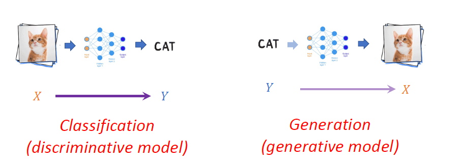

# Lecture 1 Introduction

## 0.Terminologies/Abouts/References

**总之是一节有关神经网络对实际问题中的`工具`和`想法`的一门课**

1.设计神经网络

2.学习好的映射($X \rightarrow Y$,$Y \rightarrow X$)

3.如何部署训练好的模型解决现实世界问题

4.广泛对当前活跃研究领域的理解

## 1.A comprehensive history recap

1.What is deep learning?

>   Deep Learning is a class of `machine learning methods `that use `neural networks` to `learn representations` from raw data.
>
>   是一种通过使用机器学习方法中的神经网络来学习数据的表示
>
>   

2.What makes deep learning so special?

>   不同于Conventional machine learning (shallow learning)浅层学习
>
>   >   需要手动为x设计特征,然后学习,最后的结果是固定的
>
>   Deep Learning (end-to-end learning)深度学习
>
>   >   通过神经网络端到端的学习参数
>
>   **假设1:一个神经网络可以(大概)表示任何函数**
>
>   **假设2:一个好的算法可以(自动)得到一个好的神经网络**

3.ANN(Artificial Neural Network)

>   ANN是一个基于连接结点(人工神经元)的计算系统,是一种生物脑的宽松给实现
>
>   >   连接也叫做边
>   >
>   >   神经元和边通常存在权重联系
>   >
>   >   随着学习进行,权重会进行调整
>   >
>   >   每个神经元的输出是非线性函数输出值的总和
>   >
>   >   

4.连接主义(Connectionism)

>   人脑本身就是一种连接主义的机器
>
>   人脑的思考的过程就是这里连接组成的函数
>
>   连接主义认为全部世界知识是元素之间的连接形成的
>
>   
>
>   这个连接机器存在很多非线性处理单元
>
>   循环连接也可能决定记忆

5.图灵机(Turing's Connectionist Machines)

>Intelligent Machinery中提到人类智能能实现的原因:合适的教育
>
>教育:奖赏-乘法机制

6.McCulloch-Pitts Neuron

>**第一个神经元的数学模型**
>
>被视为大脑中"神经网络"的计算模型
>
>布尔单元:$x_n\in \{0,1\},g(x) = \sum_ix_i ,y = f(g(x)) = \mathbb{I}[g(x)>\theta]$
>
>可以表示任何布尔表达式
>
>

7.Hebbian Learning

>   是神经网络的第一个学习算法
>
>   原则:Cells that fire together wire together
>
>   >   如果对于神经元x,不断地激活神经元y,那么他们之间地神经突触会越来越大
>
>   数学模型:$w_i = w_i + \eta x_i y $
>
>   

8.第一次尝试实现AI:SNARC

>SNARC(Stochastic Neural Analog Reinforcement Calculator)
>
>

9.第一次AI之春(Perceptron感知机)

>   

10.感知机的数学公式以及学习策略

>   
>
>   
>
>   **`使用多个感知机进行决策`**
>
>   
>
>   **`感知机不能额解决全部问题`**
>
>   
>
>   **`感知机的性质(Boolean/个数/和逻辑环路的关系)`**
>
>   
>
>   **`训练感知机参数的方式(每个感知机都是一个维度)`**
>
>   

11.第一个AI之冬

>1.感知机不能解决XOR问题
>
>2.NPC问题无法解决
>
>3.Frank之死
>
>4.MLP作为万能逼近器,但是找不到最优解

12.可导函数的出现(确定了下降可行方向以及可量化的梯度)

>   感知机训练:一种基于错误样本的训练->需要进行联合优化
>
>   
>
>   
>
>   **`反向传播算法+weight-decay的出现`(Hinton!!)**
>
>   
>
>   >   发现反向传播算法可以自动学习特征

13.连接主义的复兴(CNN/LeNet/NLP)

>   
>
>   
>
>   
>
>   

14.DL的领域

>   1.计算机视觉的快速发展:图像分类/大模型
>
>   2.NLP:大数据+大模型
>
>   3.四巨头(反向传播+CNN+LM(Attention)+RNN)
>
>   
>
>   

## 2.some programming basics

Google Lab(略)