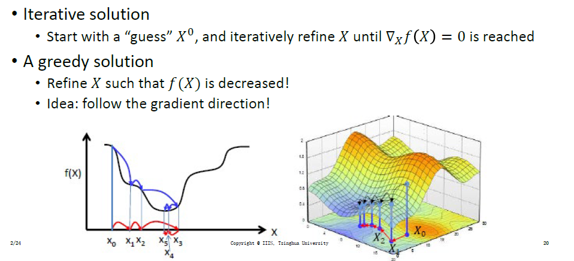
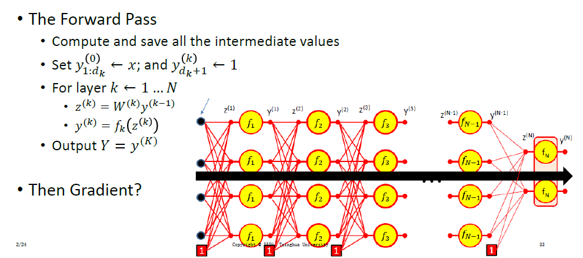
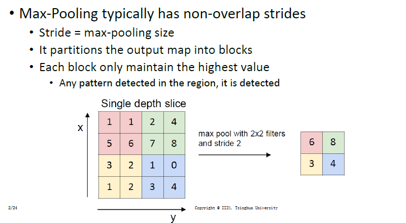

# Lecture 2 Supervised Learning(1)

## 1.Classification

**1.分类问题**

>首先是二分类问题:包括线性可分数据/分类器
>
>>   二分类目标:得到一个分类器,能正确对数据分类--最小化错误
>
>分类中的机器学习:
>
>>   定义一个好的损失函数,通过数据进行最大似然估计?
>
>

**2.损失函数(Logistic Regression)**

>首先是激活值的表示,然后是sigmoid函数的表达式,交叉熵损失函数
>
>

**3.单层感知机**

>单层感知机的学习:依然是最小化错误率
>
>>   如果使用阶跃函数:错误驱动的学习(其中$$ (y_i - ŷ_i)$$)
>>
>>   >$$w_{new} = w_{old} + η * (y_i - \hat{y}_i) * x_i$$
>>   >
>>   >$$b_{new} = b_{old} + η * (y_i - \hat{y}_i)$$
>>
>>   如果使用非线性函数(sigmoid):可以通过梯度来算(凸优化问题)
>
>
>
>

**3.函数优化问题(凸优化)**

>(无约束极值问题)如果梯度等于0 + 海森矩阵正定 = 严格局部最优解
>
>(正定:positive definiteness)
>
>

**4.梯度概念(偏导集合):将下降最快的作为下降方向:即负梯度方向**

>
>
>
>
>
>
>**梯度的方向是垂直于(perpendicular)水平曲线的**

**5.海森矩阵:二阶导集合**

>

**6.方程最优化:还是无约束极值问题,判断梯度和海森矩阵**

**7.如果计算分析法不可用(not feasible):梯度下降法**

>
>
>最优化的流程:初始可行解->迭代->计算决策边界->更新/停止
>
>
>
>梯度特点:震荡的梯度(如果满足η最优,最速下降法,梯度方向正交)
>
>

**8.单层感知机的学习(梯度下降法)**

>
>
>

**9.多种类分类(和多任务分类区分开):使用`softmax`函数**

>   
>
>   >   `softmax`可以很好地将向量转换为条件概率分布
>
>   同样地,多种类分类包括分类函数,学习策略,损失函数
>
>   >   **这里使用的是负对数似然函数-交叉熵损失函数**
>   >
>   >   交叉熵损失函数**使用的时候一定要注意独热编码(one-hot encode)**
>
>   
>
>   
>
>   

**10.多层感知机的学习计算**

>**这里有一个快速计算所有梯度的策略:链式法则+反向传播**
>
>
>
>
>
>
>
>**前向传播:计算激活值z和输出y**
>
>
>
>**反向传播:尽量使用已经计算的值**
>
>
>
>**1.首先求关于激活值z的偏导:**$$\frac{\partial Div}{\partial z^{(N)}_i} = f^{'}_N(z^{(N)}_{i})\frac{\partial Div}{\partial y^{(N)}_i}$$
>
>
>
>**2.然后求关于权重q的偏导:**$$\frac{\partial Div}{\partial w^{(N)}_{11}} = \frac{\partial z_1^{N}}{\partial w^{(N)}_{11}}\frac{\partial Div}{\partial z^{(N)}_{1}} = y^{(N-1)}_1\frac{\partial Div}{\partial z^{(N)}_{1}}$$
>
>
>
>**3.然后求关于上一层净输出的偏导:**$$\frac{\partial Div}{\partial y_1^{(N-1)}} = \sum_j\frac{\partial z^{(N))}_{j}}{\partial y^{(N-1)}_{1}}\frac{\partial Div}{\partial z^{(N)}_{j}} = \sum_jw^{(N)}_{ij}\frac{\partial Div}{\partial z^{(N)}_{j}}$$

**11.设计MLP(包括设计宽度深度/损失函数/学习率/正则化项)**

>**1.判断相关(使用0-1函数输出内容更相关)**
>
>
>
>
>
>**2.激活函数(额外注意梯度消失:x负半轴和非饱和区)**
>
>
>
>
>
>**3.学习率:目前先大学习率->逐渐变小**
>
>**4.正则化(权重衰减):L2岭回归**

## 2.CNN

**在声音识别中使用MLP遇到的问题:只能找到一段/需要大量训练数据**

>   根据数据的平移不变性:Intuition:每个片段都拿来训练一个MLP
>
>   
>
>   **MLP的全流程:**
>
>   
>
>   
>
>   **优化方向:每个神经元对不同区域的响应不饱和,层间无联系**
>
>   
>
>   **通过Distributed Scanning,完成了特征图的识别**
>
>   
>
>   **这种平移加权的公式就称作卷积操作**
>
>   
>
>   **大幅度降低了参数量,因为层间权重共享了**
>
>   
>
>   **扫描特征图的东西我们称之为滤波器(filter)卷积核,还有感受野,以及步长**
>
>   
>
>   

**2.扫描方式(通过步长/填充控制)**

>   
>
>   

**3."J字抖动"--maxpooling**

>   
>
>   
>
>   

**4.CNN的定义:就是这四个内容的集合**

>   

**5.Oth关键内容**

>**1.Temporal Convolution Network**
>
>
>
>**2.Max-pooling的变种`Avgpool`以及下采样**
>
>
>
>**3.基本的CNN架构**
>
>
>
>