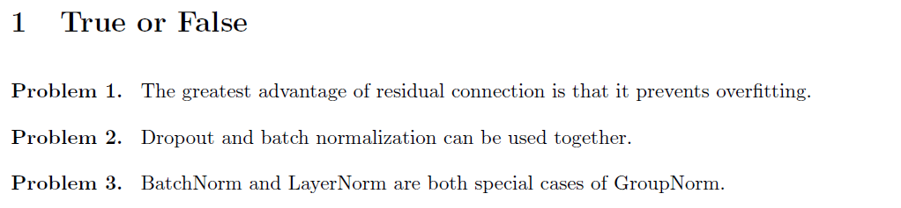
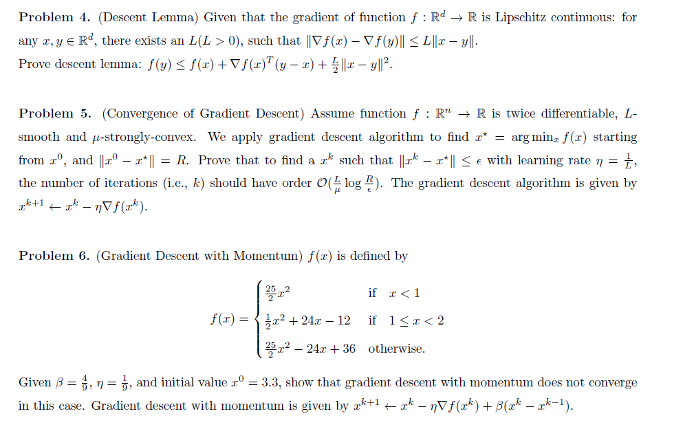

# Homework



>F:应该是避免了梯度消失
>
>F:可以使用但是尽量不一起使用(Dropout会改变BN依赖的均值和方差)
>
>>   即可以先BN->然后Dropout
>>
>>   但是先进的网络架构已经默认不使用Dropout,BN的正则化很强了
>
>F:BN并不是GN的特例
>
>>**Group Normalization (GN)** 是一种将通道（channels）分成若干组（groups）进行归一化的方法。通过调整组的数量，可以得到 Layer Normalization 和 Instance Normalization。

****



Problem 4(证明下降引理)

>给定函数$`f:\mathbb{R}^d \rightarrow \mathbb{R}`$的梯度是L-Lipschitz连续的,即对于任意的$`x,y \in \mathbb R^d`$,存在一个$`L>0`$，使得$`∥∇f(x)−∇f(y)∥≤L∥x−y∥`$
>
>(1)根据微积分基本定理:
>
>```math
>f(y) - f(x) = \int_0^1 \nabla f(x + t(y - x))^T (y - x) dt
>```
>
>(2)两边同时减去$`\grad f(x)^T (y-x)`$并且写成$`\int^1_0 \grad f(x)^T(y-x)dt`$
>
>```math
>f(y) - f(x) - \nabla f(x)^T(y - x) = \int_0^1 (\nabla f(x + t(y - x)) - \nabla f(x))^T (y - x) dt
>```
>
>(3)对积分内的部分使用柯西-施瓦茨不等式$`a^Tb≤||a||||b||`$
>
>```math
>(\nabla f(x + t(y - x)) - \nabla f(x))^T (y - x) \le \|\nabla f(x + t(y - x)) - \nabla f(x)\| \|y - x\|
>```
>
>(4)利用题目给出的L-利普希茨连续条件。令公式中的$`x`$为$`x+t(y−x)`$,$`y`$为$`x`$
>
>```math
>\|\nabla f(x + t(y - x)) - \nabla f(x)\| \le L\|(x + t(y - x)) - x\| = L\|t(y - x)\| = Lt\|y - x\|
>\\ \\
>f(y) - f(x) - \nabla f(x)^T(y - x) \le \int_0^1 (Lt\|y - x\|) \|y - x\| dt = L\|y - x\|^2 \int_0^1 t dt
>```
>
>(5)计算定积分$`\int^1_0 tdt=\frac{1}{2}`$,移项整理
>
>```math
>f(y) - f(x) - \nabla f(x)^T(y - x) \le \frac{L}{2}\|y - x\|^2
>\\ \\
>f(y) \le f(x) + \nabla f(x)^T(y - x) + \frac{L}{2}\|x - y\|^2
>```

**问题 5：梯度下降的收敛性证明**

>假设函数f是二次可微、L-光滑（L-smooth）且μ-强凸（μ-strongly-convex）的。我们使用梯度下降算法$`x^{k+1}←x^k−η∇f(x^k)`$寻找最优解$`x^*`$,初始点为$`x^0`$,且$`||x^0 - x^*|| = R`$,证明当学习率为$`\eta = \frac{1}{L}` $时,找到一个$`x^k` $使得$`||x^k - x^*||\leq \epsilon`$,所需迭代次数k的数量级为$`O(\frac{L}{\mu}log \frac{R}{\epsilon})` $
>
>(1)**建立线性收敛速率**
>
>```math
>\|x^{k+1} - x^*\|^2 \le \left(1 - \frac{\mu}{L}\right) \|x^k - x^*\|^2
>```
>
>(2)**递归展开不等式**
>
>```math
>\|x^k - x^*\|^2 \le \left(1 - \frac{\mu}{L}\right) \|x^{k-1} - x^*\|^2 \le \dots \le \left(1 - \frac{\mu}{L}\right)^k \|x^0 - x^*\|^2
>```
>
>(3)**求解迭代次数 k**
>
>```math
>\left(1 - \frac{\mu}{L}\right)^k R^2 \le \epsilon^2\Rightarrow \left(1 - \frac{\mu}{L}\right)^k \le \left(\frac{\epsilon}{R}\right)^2
>```
>
>(4)**使用对数求解 k**
>
>```math
>k \log\left(1 - \frac{\mu}{L}\right) \le 2 \log\left(\frac{\epsilon}{R}\right) = -2 \log\left(\frac{R}{\epsilon}\right)
>\\ \\
>k \ge \frac{-2 \log(\frac{R}{\epsilon})}{\log(1 - \frac{\mu}{L})} = \frac{2 \log(\frac{R}{\epsilon})}{-\log(1 - \frac{\mu}{L})}
>```
>
>(5)**对数近似不等式**
>
>```math
>\because x\in(0,1),-log(1-x)\geq x
>\\ \\
>\therefore x = \frac{\mu}{L},-log(1-\frac{\mu}{L})\geq \frac{\mu}{L}
>\\ \\
>\therefore k \ge \frac{2 \log(\frac{R}{\epsilon})}{\frac{\mu}{L}} = 2\frac{L}{\mu} \log\left(\frac{R}{\epsilon}\right)
>```
>
>**证毕**

**问题 6：动量梯度下降法的不收敛情况**

>给定分段函数$`f(x)`$，以及参数$`β=94,\eta = 91`$和初始值$`x^0=3.3`$
>
>证明动量梯度下降法$ ‘x^{k+1}=x^k−η∇f(x^k)+β(x^k−x^{k−1})‘$在此情况下不收敛。
>
>```math
>f(x) = \begin{cases} 
>\frac{25}{2}x^2 & \text{if } x < 1 \\\\
>\frac{1}{2}x^2 + 24x - 12 & \text{if } 1 \le x < 2 \\\\
>\frac{25}{2}x^2 - 24x + 36 & \text{otherwise}.
>\end{cases}
>```
>
>(1)**求导**
>
>```math
>f'(x) = \begin{cases} 
>25x & \text{if } x < 1 \\ \\ 
>x+24 & \text{if } 1 \le x < 2 \\ \\
>25x - 24 & \text{if } x \ge 2 
>\end{cases}
>```
>
>(2)**迭代**
>
>```math
>\begin{align}
>&x^1 = x^0 - \eta\nabla f(x^0) + \beta(x^0 - x^{-1}) = 3.3 - \frac{1}{9}(58.5) + 0 = 3.3 - 6.5 = -3.2
>\\ \\
>&x^2 = x^1 - \eta\nabla f(x^1) + \beta(x^1 - x^0) = -3.2 - \frac{1}{9}(-80) + \frac{4}{9}(-3.2 - 3.3) = -3.2 + \frac{80}{9} - \frac{26}{9} = -3.2 + \frac{54}{9} = -3.2 + 6 = 2.8
>\\ \\
>&x^3 = x^2 - \eta\nabla f(x^2) + \beta(x^2 - x^1) = 2.8 - \frac{1}{9}(46) + \frac{4}{9}(2.8 - (-3.2)) = 2.8 - \frac{46}{9} + \frac{24}{9} = 2.8 - \frac{22}{9} \approx 2.8 - 2.44 = 0.36
>\end{align}
>```
>
>会发现误差绝对值在不断变化显著增大,无法持续逼近最优解