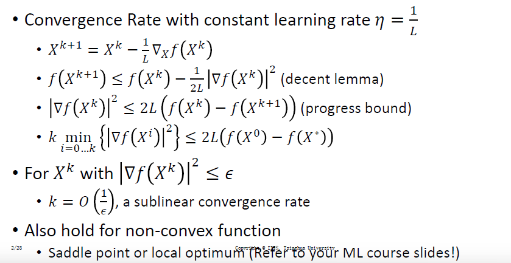

# Lecture 3 Supervised Learning(2)

## 1.Design a better algorithm

**1.Recap:训练神经网络的基本表示**

>训练数据:$$X = \{(x^i,y^i) \}$$
>
>神经网络:$$y = f(x;\theta)$$
>
>损失函数:$$L(\theta) = \frac{1}{N}\sum_i err(f(x^i;\theta);y^i) $$
>
>目标:最小化损失(错误率)
>
>优化算法:迭代的梯度下降法(直到达到某阈值)

**2.凸优化**

>   (1)凸函数形式(充分条件,半正定)
>
>   ```math
>   \begin{align}
>   &f(x + y)\leq \frac{1}{2}(f(x) + f(y))
>   \\ \\
>   &\grad^2f(x)\geq 0
>   \end{align}
>   ```
>
>   (2)Lipschitz连续的形式
>
>   ```math
>   |g(x)-g(y)|\leq L|x-y|
>   ```
>
>   (3)L-smooth凸函数(满足Lipschitz连续的凸函数)
>
>   >   1.函数是凸函数
>   >
>   >   2.f(x)的梯度是满足Lipschitz连续的
>   >
>   >   3.梯度下降的速度不会随便无限大
>   >
>   >   
>
>   (4)激活函数(尤其是ReLu和ELU)
>
>   
>
>   
>
>   (5)凸优化:下降引理(由L-smooth凸函数得到)
>
>   >   ```math
>   >   f(y)\leq f(x) + \grad f(x)^T (y-x)+\frac{L}{2}|x-y|^2
>   >   ```
>   >
>   >   其中最后一部分叫做**二次上界**表示了函数的增长值
>   >
>   >   (通过微积分展开+lipschitz定理+柯西不等式得到)
>   >
>   >   ```math
>   >   \begin{align}
>   >   &1.微积分基本定理:  f(y)- f(x) = \int^{1}_{0}\grad f(x+t(y-x))^T(y-x)dt
>   >   \\ \\
>   >   &2.展开:f(y)-f(x) = \int^{1}_{0}(\grad f(x + t(y-x)) - \grad f(x))(y-x)dl + \int^{1}_{0}\grad f(x)^T (y-x)dt
>   >   \\ \\
>   >   &3a.第二个积分直接化简:\int^{1}_{0}\grad f(x)^T(y-x)dt = \grad f(x)^T (y-x)
>   >   \\ \\
>   >   &3b.第一个积分使用柯西不等式和L光滑:\int^{1}_{0}(\grad f(x+y(y-x)) - \grad f(x))^T(y-x)dt \leq \int^{1}_{0}L||t(y-x)|| ||y-x||dt = \frac{L}{2}||y-x||^2
>   >   \\ \\
>   >   &4.代入(2)式:f(y)\leq f(x)^T(y-x) + \frac{L}{2}||x-y||^2(二次上界)
>   >   \end{align}
>   >   ```
>   >
>   >   推论1:存在一个二次上界(泰勒展开+二次项)
>   >
>   >   推论2:存在最优学习率(1/L常数)
>   >
>   >   推论3:学习率区间$$(0 < \eta < \frac{2}{L})$$
>   >
>   >   
>
>   (6)凸优化:进展限界(progress-bound)
>
>   >```math
>   >|\grad f(x^K)|^2\leq 2L(f(x^K) - f(x^{k+1}))
>   >```
>   >
>   >推理方法:将前后两个点代入下降引理,然后取极值
>   >
>   >同时结论:如果L-凸函数,找到下一个点的迭代次数为$$O(\frac{1}{\epsilon})$$
>
>   (7)但是如果是非凸函数,只能得到鞍点或者局部最小点
>
>   >
>
>   (8)如何得到L常数
>
>   >   a.从大的学习率到小的学习率
>   >
>   >   b.自适应调整:包括
>   >
>   >   1.函数值自然下降的方向 2.从较大步长开始不断缩小(Armijo条件:只要下降方向和负梯度方向夹角不是直角)
>   >
>   >   (Oth:比如Wolfe条件)
>
>   4.强凸函数(存在更强的结论)
>
>   
>
>   

**3.二阶优化(从图中可见是让椭圆变成圆,主要使用了海森矩阵和牛顿法)**

>
>
>然而也确实是这样,对axis进行缩放
>
>
>
>如果一个函数是一般L-光滑强凸函数->牛顿法(即泰勒展开)
>
>
>
>**对于一个具有Lipschitz连续海森矩阵的强凸函数,牛顿法具有二次收敛性**
>
>因为海森矩阵本身描述了函数的局部曲率;Lipschitz海森则保证了局部曲率的变化率不会太大
>
>牛顿法:$$f(y) \approx f(x) + \grad f(x)^T(y-x)+ \frac{1}{2}(y-x)^T\grad^2f(x)(y-x)$$
>
>Lipschitz Hessian 条件保证了这个近似的**误差是可以被控制的**
>
>**海森矩阵存在的问题:主要是太贵了(无论是得到还是求逆),并且由于负特征值，非凸函数可能会发散**

**4.Accelerated Methods(回归到一阶优化)**

>从图上看,可能有些维度是趋同的,有些维度是振荡的
>
>
>
>**(1)提出了带有动量的梯度下降法**
>
>
>
>**(2)基于未来目标的动量梯度下降优化**
>
>>   主要好处在于:通过未来的梯度和当前的梯度进行联合计算,可以修正方向
>>
>>   传统的momentum:可能会超过最优点然后回头
>>
>>   NAG:先用动量计算出将要到达地点,然后动态调整更新步伐
>
>
>
>

**5.凸优化总结**

>1.自适应学习率有助于收敛(不仅是NAG,还有RMSprop,Adamw等算法)
>
>2.存在有些维度是趋同的,有些维度是振荡的(使用批归一化改变地形+高级优化算法)
>
>3.二阶优化太贵了
>
>4.带有动量的方法可以显著改善GD的表现

**5.在NN中运用优化算法**

>包括基本的学习术语
>
>
>
>**具体优化算法1:随机梯度下降法(有关收敛程度和收敛率)**
>
>
>
>
>
>**具体的优化算法2:mini-batch(分批训练)GD**
>
>>   使用它的原因:GD要求显存太大,SGD带来的噪音太大(但是能有效跳出局部极值/鞍点)
>
>
>
>
>
>
>
>**深度学习的推论(不适用于小网络和其它邻域比如深度强化学习)**
>
>1.鞍点的出现频率高于局部极值
>
>2.大多数局部极小值和全局极小值是接近的(所以得到局部极小点也可以)
>
>**具体的优化算法3:改进的梯度下降**
>
>>   观察得到,可以减少每次优化的长度,让振荡幅度变小
>>
>>   
>>
>>   **AdaGrad:退火学习率(annealing learning rate)**
>>
>>   
>>
>>   RMSProp(AdaGrad的优化版本,避免了学习率消失,并且在RNN表现良好)
>>
>>   
>>
>>   Adam优化器(RMSProp的优化,增加了动量)适用于RNN,生成式模型,RNN
>>
>>   
>>
>>   
>>
>>   

## 2.Tricks for practical classification


**1.AlexNet中的技巧:ReLU激活函数+重复的pooling:**

**2.AlexNet中的技巧:数据增强(数据像素值的归一化,尺寸的归一化224*224,输出预测的平均化ensemble,色彩通道增强,增加PCA组件)**

**3.AlexNet中的技巧:Dropout随机关闭一些神经元(避免过拟合):实际中我们使用伯努利分布来关闭神经元**

>   Dropout改变了输出神经元的规模,梯度只在未关闭的神经元中流动

**4.更多技巧:早停法(在Validation验证集中的错误率显著上升前)**

**5.更多技巧:神经元初始化(为0则所有神经元无法学习[相同的模式],太大则会导致梯度爆炸)**

>   初始化原则:让每层神经元的输出激活值的平均值为0(使用sigmoid函数或者tanh函数分布的值)/激活层的方差在各层间保持不变(防止梯度爆炸消失)
>
>   Xavier初始化:通过计算权重的方差进行初始化
>
>   
>
>   Kaiming初始化:ReLU会将一半的输入置为0,会改变方差,修正了ReLU的方差
>
>   

**6.更多技巧:使用预训练的模型进行微调**

**7.更多技巧:使用梯度修剪**

**8.更多技巧:协方差变换(因为mini-batch会让数据拥有类似的分布),让数据使用相同的均值和标准差进行训练**

**9.更多技巧:Batch-Normalization(批归一化)对输出值进行零均值和标准差处理(反向传播也相同)**

>但是需要额外注意:使用BN没必要Dropout/BN是直接作用于某层的/使用BN可以大胆使用更大的学习率和衰减率
>
>
>
>
>
>

**10.更多技巧:Layer-Normalization(层归一化)**

>   对隐藏层进行均值和标准差的归一化
>
>   

**11.更多技巧:更多的归一化技巧**

>

## 3.Advanced Architecture

**1.ResNet**

>**Residual block:避免深度增加导致的梯度消失**
>
>
>
>

**2.DenseNet**

>

**3.FCN(广泛应用于Segmentation,使用了金字塔)**

>   


